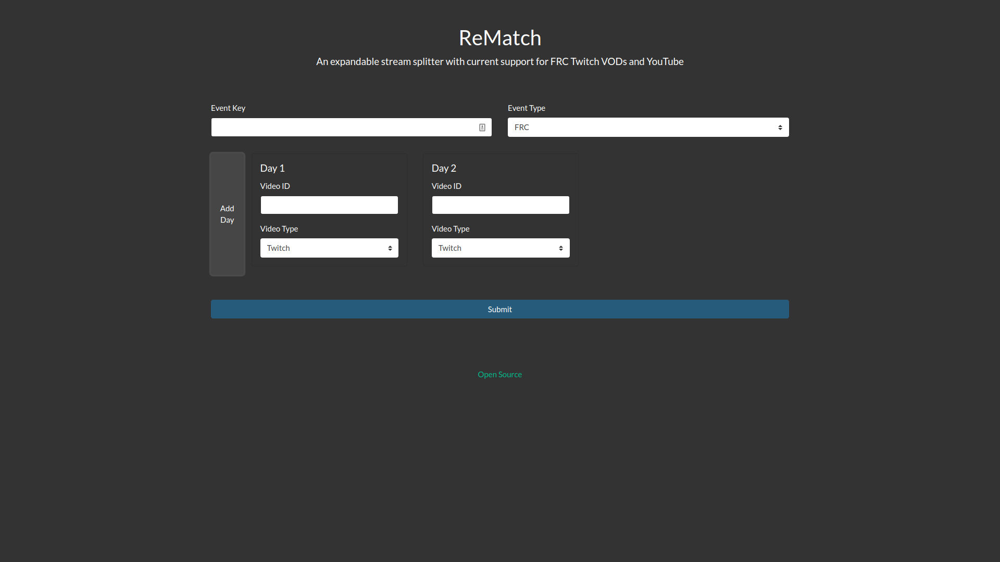

# ReMatch
An expandable event stream archive to individual match clips splitter.

## Features
* Automated splitting for FRC events.
* Multi-day support.
* Once the archive has been downloaded, the splitting operation is fast.
* Automatically organizes the clips into a folder for that event.
* Can use hosted copy (fill out the form below for inquiries) or self-host your own.
* Easily expandable to other event types
* Can be invoked either through the command line or a nice web dashboard.

## Installation
If you are interested in self-hosting your own copy, the easiest way to do so is using Docker, and you can find instructions for that at [DOCKER_INSTALL.md](DOCKER_INSTALL.md). 
If you would rather set up a direct copy, check out [WINDOWS\_INSTALL.md](WINDOWS_INSTALL.md) if you're a Windows user and [POSIX\_INSTALL.md](POSIX_INSTALL.md) if you are using it on Linux or macOS.

In addition, you may need to take extra steps to set up for your inputs. If for example you are using ReMatch for FRC, you need to follow [FRC_CONFIG.md](FRC_CONFIG.md) for ReMatch to work properly.

## Usage
There are multiple ways to use ReMatch. The simplest is to [fill out this form](https://tweirtx.github.io/rematch-request) and I'll get back to you as soon as I run the job.

If you are self-hosting, web control gives you a nice interface to the ReMatch backend. To start the web interface, open a terminal prompt and change to your ReMatch directory. Run `python3 web/web.py` to start the interface, then you can use it by browsing to localhost:5000.

## Limitations
* Only Twitch VODs are supported for the time being.
* Setup for a self-hosted instance is complicated.

## To Be Implemented
* Intro addition to all clips
* The Orange Alliance support

## Credits
### People 
tweirtx - Main developer

ofekashery - Web front-end

## Libraries
[tbapi](https://github.com/octocynth/tbapi): Python library for querying The Blue Alliance (FRC info)

[psycopg2](https://github.com/psycopg/psycopg2): Python DB API 2.0 wrapper for libpq (PostgresQL)

[python-twitch-client](https://github.com/tsifrer/python-twitch-client): Python library for querying Twitch

[youtube-dl](https://github.com/rg3/youtube-dl): Used to download the stream archive

[flask](https://github.com/pallets/flask): Web control backend

## Donations
No donation is required, but if you're feeling generous you can donate to me at [paypal.me/tweirtx](https://paypal.me/tweirtx) and in return you will receive my gratitude (and priority on your official ReMatch video requests).
